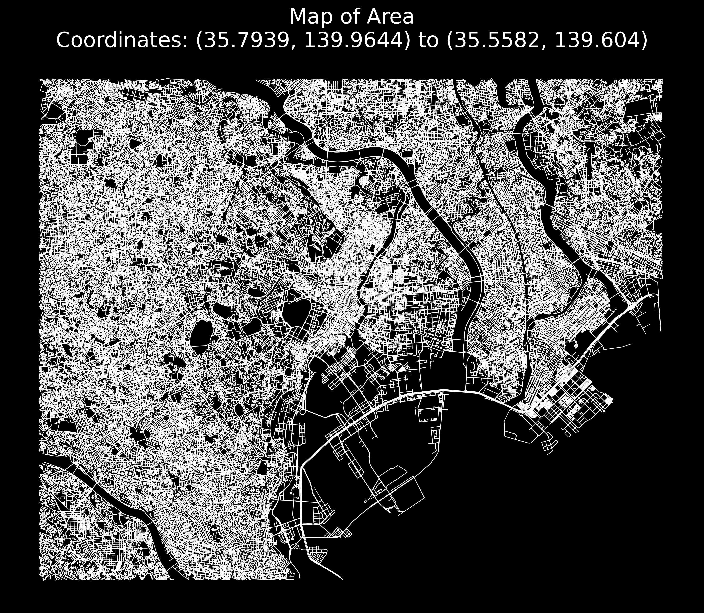

# Map Plotter
A Simple Python Tool for Visualizing Maps
Map Plotter is a lightweight Python application designed to help you visualize maps based on specified coordinates. With just a few inputs, you can generate a clear representation of roads and pathways.

Features:

    Easy-to-use interface for inputting map coordinates
    Automatic generation of road layouts based on your specifications

Get started by specifying your coordinates, and let Map Plotter do the rest!

## Output example

## Negative output example

